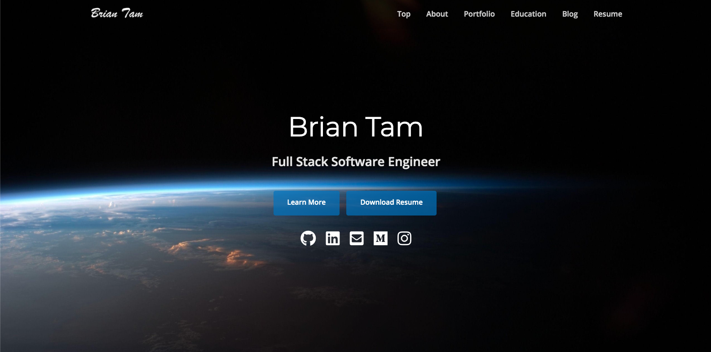
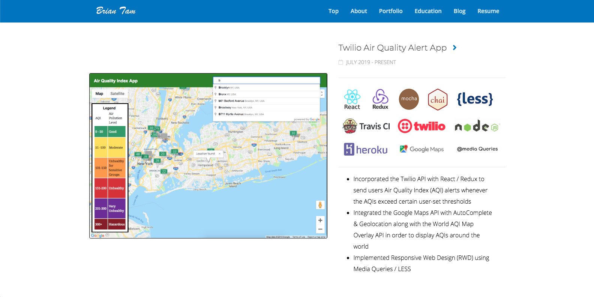

# 💻 Brian Tam's Portfolio Website

A Single Page Website with Bootstrap 4 created with libraries such as: jQuery, Font Awesome Icons, Animate.css, WOW.js, and Retina.js. It also implements Responsive Web Design (RWD) using Media Queries.

 

## Table of contents
* [What is Font Awesome?](#what-is-font-awesome?)
* [Live Demo](#live-demo)
* [Dependencies](#dependencies)
* [Contact](#contact)

## What is Font Awesome?
[Font Awesome](https://fontawesome.com/v4.7.0/) gives you scalable vector icons that can instantly be customized — size, color, drop shadow, and anything that can be done with the power of CSS.

## Live Demo

Currently deployed to [GitHub Pages](http://briantam23.github.io)!

## Dependencies

* [Bootstrap 4](https://getbootstrap.com/)
* [jQuery](https://jquery.com)
* [Font Awesome](https://fontawesome.com/)
* [Animate.css](https://daneden.github.io/animate.css)
* [Waypoints](http://imakewebthings.com/waypoints)
* [WOW.js](https://wowjs.uk)

## Contact
Feel free to contact me at [briantam23@gmail.com](mailto:briantam23@gmail.com)!

Personal Website - [briantam23.github.io](http://briantam23.github.io)  
LinkedIn - [@briantam23](https://linkedin.com/in/briantam23/)  
Github - [@briantam23](https://github.com/briantam23)